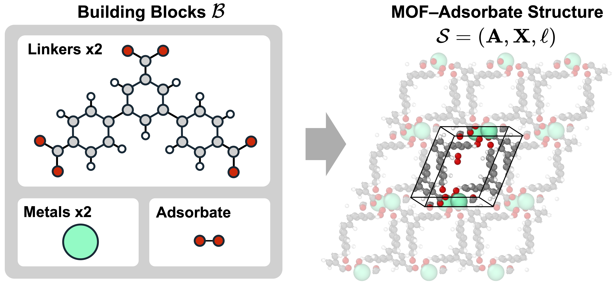

# All-Atom Flow Matching for MOF-Adsorbate Structure Prediction (AtomMOF)

[](https://www.arxiv.org/abs/2602.07351)

<!-- Add any additional badges here, e.g.: -->
<!-- [](https://opensource.org/licenses/MIT) -->

<p align="center">
  
</p>

## Table of Contents

- [Installation](#installation)
  - [Clone Repository](#clone-repository)
  - [Setup Environment](#setup-environment)
- [Preprocessing Data](#preprocessing-data)
- [Download Checkpoints](#download-checkpoints)
- [Training](#training)
  - [Pretraining](#pretraining)
  - [Fine-Tuning](#fine-tuning)
- [Generating Predictions](#generating-predictions)
- [Evaluation](#evaluation)
  - [BWDB](#bwdb)
  - [ODAC25](#odac25)
- [📚 Citation](#-citation)

## Installation

### Clone Repository

```bash
git clone https://github.com/nayoung10/AtomMOF.git
cd AtomMOF
```

### Setup Environment

We use [`uv`](https://github.com/astral-sh/uv) for fast, reproducible dependency management.

**Install `uv`:**

```bash
wget -qO- https://astral.sh/uv/install.sh | sh
```

**Create and activate the environment:**

```bash
uv venv atommof  --python 3.10.12
source atommof /bin/activate
```

**Install dependencies:**

```bash
# Install PyTorch (CUDA 12.6)
uv pip install torch==2.6.0 torchvision==0.21.0 torchaudio==2.6.0 --index-url https://download.pytorch.org/whl/cu126

# Install remaining dependencies
uv pip install -r requirements.txt
```

<details>
<summary><b>Blackwell and newer GPU support (CUDA 12.8+)</b></summary>

Replace the PyTorch installation step with:

```bash
uv pip install torch==2.7.0 torchvision==0.22.0 torchaudio==2.7.0 --index-url https://download.pytorch.org/whl/cu128
```

</details>

<details>
<summary><b>Troubleshooting: <code>pyeqeq</code> build error</b></summary>

If you encounter a compilation error with the `pyeqeq` package, set the C++ standard header flag before installing:

```bash
CXXFLAGS="-include cstdint" uv pip install -r requirements.txt
```

</details>

<!-- Optional: mention any external tools needed -->
<!-- For **[feature name]**, we need to install `[tool]` from [here](https://link-to-tool). -->

## Preprocessing Data

There are two options for preparing the dataset:

1. Use our preprocessed dataset.
2. Preprocess the dataset yourself: first download the raw dataset from [source](https://link-to-raw-data), then run our scripts for further processing.

<!-- Optional note about building from scratch -->
<!-- **Note:** If you want to build your own dataset from raw files, start by processing them with the scripts provided in [dependency](https://link), then apply our preprocessing pipeline. -->

### Option 1: Use Preprocessed Data

Download the preprocessed dataset from [Hugging Face (`nayoung10/AtomMOF-data`)](https://huggingface.co/datasets/nayoung10/AtomMOF-data) into the `data/` directory:

```bash
mkdir -p data
hf download nayoung10/AtomMOF-data \
  --repo-type dataset \
  --include "bwdb/**" \
  --include "odac25/**" \
  --local-dir data
```

After download, the directory structure should look as follows:

```
data/
├── bwdb/
│   ├── metal/
│   │   └── metal_lib_csp.pkl
│   ├── bwdb_test_metadata.pkl
│   ├── bwdb_test.lmdb
│   ├── bwdb_train_metadata.pkl
│   ├── bwdb_train.lmdb
│   ├── bwdb_val_metadata.pkl
│   └── bwdb_val.lmdb
└── odac25/
    ├── metal/
    │   └── metal_dict_train.pkl
    ├── odac25_test_metadata.pkl
    ├── odac25_test.lmdb
    ├── odac25_train_metadata.pkl
    ├── odac25_train.lmdb
    ├── odac25_val_metadata.pkl
    ├── odac25_val.lmdb
    └── test_system_indices.pkl
```

### Option 2: Preprocess Data Yourself

<details>
<summary><b>Expand raw-data preprocessing steps (BWDB and ODAC25)</b></summary>

Preprocessing scripts are located in `src/preprocess/`. The overall pipeline is the same for both datasets—decompose MOFs into building blocks, build a metal library, extract features, and produce the final LMDB files—but the scripts differ because the raw source datasets are formatted differently. For example, the BWDB raw dataset is already decomposed with MOFid, whereas the ODAC25 raw dataset is already split and has been filtered with MOFChecker for validity.

> **Adapting to your own dataset:** If you want to apply this pipeline to a custom dataset, we recommend following the ODAC25 preprocessing as a reference, since it covers the MOFid extraction and could be more helpful.

#### BWDB

1. Download and extract raw BWDB dataset (`bw_db.tar.gz`) from [MOFDiff zenodo](https://zenodo.org/records/10806179).

2. **Filter and split** into train/val/test sets (filters MOFs by size):

```bash
python -m src.preprocess.bwdb.filter_and_split
```

3. **Check MOF validity** (filters out invalid MOFs using `MOFChecker`):

```bash
python -m src.preprocess.bwdb.valid_mofs
```

4. **Extract features:**

```bash
python -m src.preprocess.bwdb.extract_feats
```

5. **Build metal library** and produce the final LMDB files:

```bash
python -m src.preprocess.bwdb.metal_library
```

6. **Convert raw data to `Structure` format:**

```bash
python -m src.preprocess.bwdb.convert_data_to_structure \
  --lmdb_path <path/to/raw_lmdb> \
  --num_cpus <num_cpus>
```

Steps 2-5 use [Hydra](https://hydra.cc/) and read settings from `configs/preprocess.yaml`. You can override parameters from the command line (e.g., `preprocess.filter_and_split.num_cpus=32`).

#### ODAC25

1. Download and extract `odac25_filtered_train.tar.gz` and `odac25_filtered_val.tar.gz` from [ODAC25 Hugging Face](https://huggingface.co/facebook/ODAC25).

2. **Extract final frames** from each trajectory:

```bash
python -m src.preprocess.odac25.extract_final_frames -i data/odac25/train/mof_plus_adsorbate
python -m src.preprocess.odac25.extract_final_frames -i data/odac25/val/mof_plus_adsorbate
```

3. **Extract MOFid** (requires [`MOFid`](https://github.com/snurr-group/mofid)):

```bash
python -m src.preprocess.odac25.extract_mofid --dataset_dir data/odac25/train/mof_plus_adsorbate
python -m src.preprocess.odac25.extract_mofid --dataset_dir data/odac25/val/mof_plus_adsorbate
```

4. **Extract building blocks:**

```bash
python -m src.preprocess.odac25.extract_blocks --dataset_dir data/odac25/train/mof_plus_adsorbate --num_workers <num_workers>
python -m src.preprocess.odac25.extract_blocks --dataset_dir data/odac25/val/mof_plus_adsorbate --num_workers <num_workers>
```

5. **Construct metal library:**

```bash
python -m src.preprocess.odac25.metal_library --block_lmdb_dir data/odac25/train/mof_plus_adsorbate/blocks --num_workers <num_workers>
python -m src.preprocess.odac25.metal_library --block_lmdb_dir data/odac25/val/mof_plus_adsorbate/blocks --num_workers <num_workers>
```

6. **Reconstruct MOF** (extract features):

```bash
python -m src.preprocess.odac25.extract_feats --dataset_dir data/odac25/train/mof_plus_adsorbate --num_workers <num_workers>
python -m src.preprocess.odac25.extract_feats --dataset_dir data/odac25/val/mof_plus_adsorbate --num_workers <num_workers>
```

7. **Create train/val split:**

```bash
python -m src.preprocess.odac25.split_dataset_random --dataset_dir data/odac25 --val_split 0.02
```

Alternatively, if you have specific keys for the validation split:

```bash
python -m src.preprocess.odac25.split_dataset --dataset_dir data/odac25 --val_keys_path <path/to/val_keys>
```

8. **Replace nodes for test set** (substitute template metal structures):

```bash
python -m src.preprocess.odac25.replace_nodes
```

</details>

## Download Checkpoints

Download released model checkpoints from [Hugging Face (`nayoung10/AtomMOF-ckpt`)](https://huggingface.co/nayoung10/AtomMOF-ckpt).

Published checkpoint layout:

```text
├── bwdb/
│   ├── small.ckpt
│   ├── medium.ckpt
│   └── large.ckpt
└── odac25/
    └── large.ckpt
```

Download all checkpoints:

```bash
mkdir -p logs
hf download nayoung10/AtomMOF-ckpt \
  --repo-type model \
  --include "bwdb/*.ckpt" \
  --include "odac25/*.ckpt" \
  --local-dir logs
```

Download a single checkpoint (example: BWDB medium):

```bash
hf download nayoung10/AtomMOF-ckpt \
  --repo-type model \
  --include "bwdb/medium.ckpt" \
  --local-dir logs
```

Python example:

```python
from huggingface_hub import hf_hub_download

ckpt_path = hf_hub_download(
    repo_id="nayoung10/AtomMOF-ckpt",
    filename="bwdb/medium.ckpt",
    repo_type="model",
)
print(ckpt_path)
```

## Training

To run curriculum training, use `scripts/bwdb_train.sh` or `scripts/odac25_train.sh`. You must set the model dimensions (`TOKEN_S`, `TOKEN_Z`, `TOKEN_HEAD`) and the batch limit `MAX_ATOMS_SQUARE` (= $N_{\max}^2$) based on the model size. The values below are tuned for **8× B200 (~180 GB)** and **8× NVIDIA RTX Pro 6000 Blackwell Max-Q (96 GB)** GPUs.

| Parameter                                   | AtomMOF-S (Small) |                     AtomMOF-M (Medium) | AtomMOF-L (Large) |
| ------------------------------------------- | ----------------: | -------------------------------------: | ----------------: |
| `TOKEN_S`                                   |               256 |                                    512 |              1024 |
| `TOKEN_Z`                                   |               128 |                                    256 |               512 |
| `TOKEN_HEAD`                                |                 8 |                                      8 |                16 |
| `MAX_ATOMS_SQUARE` (Stage 1: Pretraining)   |         3,000,000 |                              1,000,000 |         1,000,000 |
| `MAX_ATOMS_SQUARE` (Stage 2: Fine-tuning 1) |         3,000,000 |                              1,000,000 |         1,000,000 |
| `MAX_ATOMS_SQUARE` (Stage 3: Fine-tuning 2) |         2,500,000 |                                800,000 |           800,000 |
| **GPU setup used**                          |  8× B200 (~180 GB) | 8× RTX Pro 6000 Blackwell Max-Q (96 GB) |  8× B200 (~180 GB) |

**Notes:**

- `MAX_ATOMS_SQUARE` controls the dynamic batch cap via $N_{\max}^2$. Decrease it if you hit OOM; increase it if you have memory headroom.
- **AtomMOF-M on B200:** a higher `MAX_ATOMS_SQUARE` of **(2,000,000; 2,000,000; 1,800,000)** for **(Stage 1; Stage 2; Stage 3)** may work. *So far, this has only been tested for Stage 1.*

If you'd like to design your own curriculum learning schedule or run each stage separately, the underlying commands are provided below:

<details>
<summary><b>Standalone pretraining and fine-tuning commands</b></summary>

### Pretraining

```bash
python src/train.py \
  data=<data_name> \
  trainer.devices=<num_gpus> \
  task_name=<task_name> \
  logger=wandb \
  +trainer.num_sanity_val_steps=0 \
  data.max_num_atoms=<max_atoms> \
  data.dynamic.max_num_atoms_square=<max_atoms_square> \
  model.training_args.lr_scheduler=af3
```

### Fine-Tuning

```bash
python src/train.py \
  data=<data_name> \
  trainer.devices=<num_gpus> \
  task_name=<task_name> \
  logger=wandb \
  +trainer.num_sanity_val_steps=0 \
  pretrained_ckpt_path=<ckpt_path> \
  data.max_num_atoms=<max_atoms> \
  data.dynamic.max_num_atoms_square=<max_atoms_square> \
  model.training_args.lr_scheduler=af3
```

</details>

## Generating Predictions

Generate samples and collate predictions. This pipeline is shared across both datasets:

```bash
# Generate samples
python src/predict.py \
  data=<data_name> \
  ckpt_path=<path/to/ckpt.pt> \
  trainer.devices=<num_devices> \
  predict_args.num_samples=<num_samples> \
  predict_args.sampling_steps=<num_sampling_steps> \
  data.predict_split=<data_split> \
  data.max_num_atoms=<max_num_atoms>

# Collate predictions
python src/evaluation/collate_predictions.py --pred_dir <path/to/pred_dir>
```

## Evaluation

### BWDB

#### Match Rate & RMSD

```bash
python src/evaluation/rmsd.py \
  --pred_dir <path/to/pred_dir> \
  --num_cpus <num_cpus> \
  --stol <stol> \
  --ltol <ltol> \
  --angle_tol <angle_tol>
```

**Arguments:**

- `--pred_dir`: Path to the prediction directory containing `collated_predictions.pt` (output of `collate_predictions.py`).
- `--num_cpus`: Number of CPUs for parallel computation (default: 1).
- `--stol`: Site tolerance for structure matching (default: 0.5).
- `--ltol`: Length tolerance for structure matching (default: 0.3).
- `--angle_tol`: Angle tolerance in degrees for structure matching (default: 10).

#### Property Evaluation

Property evaluation requires [`zeo++`](https://www.zeoplusplus.org/download.html). After installing, set the `ZEO_PATH` environment variable to the `network` binary:

```bash
export ZEO_PATH=<path/to/zeo++/network>
python src/evaluation/property.py \
  --pred_dir <path/to/pred_dir> \
  --num_cpus <num_cpus>
```

#### Feynman-Kac Steering

Feynman-Kac steering requires a pretrained MLIP checkpoint. Download `esen_sm_odac25_full.pt` from [Hugging Face (facebook/ODAC25)](https://huggingface.co/facebook/ODAC25) and place it in the `logs/` directory. To use a different MLIP, see `src/models/energy/mlip.py`.

To generate structures with Feynman-Kac steering, run the prediction script with steering arguments enabled:

```bash
python src/predict.py \
  data=bwdb \
  ckpt_path=<path/to/ckpt.pt> \
  trainer.devices=<num_devices> \
  predict_args.num_samples=1 \
  predict_args.sampling_steps=200 \
  data.predict_split=test \
  predict_args.use_sde_coords=true \
  # Steering arguments (default settings)
  predict_args.steering_args.fk_steering=true \
  predict_args.steering_args.num_particles=16 \
  predict_args.steering_args.fk_lambda=2.0 \
  predict_args.steering_args.fk_resampling_interval=5 \
  predict_args.steering_args.fk_start_time=0.80 \
  predict_args.steering_args.potential_mode=immediate
```

**Note:** Adjust `data.dynamic.max_num_atoms_square` based on GPU memory (e.g., `5e5` for medium, `2e5` for large models).

After generating steered structures, evaluate them with the following metrics:

##### Validity (with `MOFChecker`)

An MOF is considered valid if it passes all `MOFChecker` checks, including the presence of key elements (e.g., C/H and a metal), no atomic overlaps, chemically reasonable coordination environments, sufficient porosity, and no isolated molecules. Generates `validity_results.csv` in the prediction directory. Requires `zeo++` on your `PATH`.

```bash
export PATH="<path/to/zeo++>:$PATH"
python -m src.evaluation.validity --pred_dir <path/to/pred_dir> --num_cpus <num_cpus>
```

##### Structure Validity

A predicted crystal structure is considered valid if (i) all pairwise interatomic distances are at least 0.5 Å, and (ii) the unit-cell volume is at least 0.1 ų. Generates `structure_validity_results.csv` in the prediction directory.

```bash
python -m src.evaluation.structure_validity --pred_dir <path/to/pred_dir> --num_cpus <num_cpus>
```

##### Energy Evaluation

Computes the MLIP energy levels for both predicted and ground-truth structures, which can then be used to compute the formation energy error (eV/atom). Generates `energy_results.csv` in `<pred_dir>/mlip_energy_<model_name>/`.

```bash
python -m src.evaluation.mlip_energy \
  --pred_dir <path/to/pred_dir> \
  --mlip_model esen \
  --mlip_ckpt_dir <path/to/mlip_ckpt_dir>
```

### ODAC25

#### Coverage

Computes per-system RMSD between predicted and ground-truth structures. The primary metric reported in the paper is **coverage recall** (`cov_recall`).

```bash
python -m src.evaluation.odac25.system_rmsd \
  --system_index_path data/odac25/test_system_indices.pkl \
  --model_pred_path <path/to/collated_predictions.pt> \
  --num_cpus <num_cpus>
```

## 📚 Citation

If you find our work useful, please consider citing the following:

```bibtex
@article{kim2026atommof,
  title={AtomMOF: All-Atom Flow Matching for MOF-Adsorbate Structure Prediction},
  author={Kim, Nayoung and Kim, Honghui and Yu, Sihyun and Kim, Minkyu and Kim, Seongsu and Ahn, Sungsoo},
  journal={arXiv preprint arXiv:2602.07351},
  year={2026}
}
```
