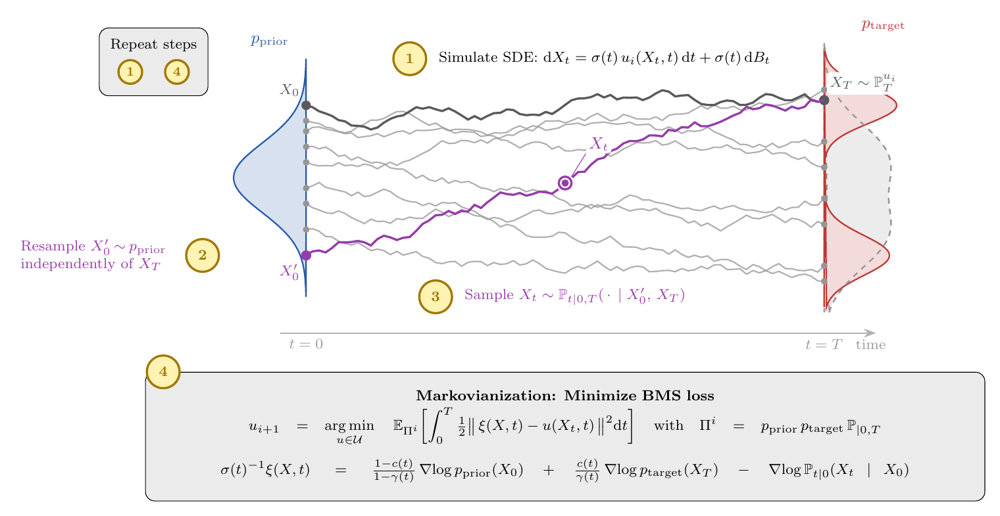

<h1 align="center">Bridge Matching Sampler (BMS)</h1>

<p align="center">
  <em>Scalable Sampling via Generalized Fixed-Point Diffusion Matching</em>
</p>

<p align="center">
  <a href="https://denisbless.github.io/BridgeMatchingSampler/"><strong>🌐 Project Page</strong></a>
  &nbsp;·&nbsp;
  <a href="docs/bms_paper.pdf"><strong>📄 Paper</strong></a>
  &nbsp;·&nbsp;
  <a href="https://github.com/DenisBless/BridgeMatchingSampler"><strong>💻 Code</strong></a>
</p>

<p align="center">
  
</p>

This repository provides a clean, self-contained implementation of the **Bridge
Matching Sampler (BMS)**, a diffusion-based sampler for unnormalized target
densities. BMS learns a stochastic transport map between an arbitrary prior and
the target distribution using a single, scalable, and stable least-squares
matching objective, and a *damped* fixed-point iteration that mitigates mode
collapse and further stabilizes training.

📄 **Paper:** [Bridge Matching Sampler: Scalable Sampling via Generalized
Fixed-Point Diffusion Matching](docs/bms_paper.pdf) (ICML 2026).<br>
🌐 **Project page:** <https://denisbless.github.io/BridgeMatchingSampler/> — overview,
method walkthrough, and an interactive demo of the fixed-point iteration.

## Method in a nutshell

BMS frames sampling as a fixed-point iteration over path measures. Each outer
iteration consists of three steps (see the illustration above):

1. **Simulate & couple.** Sample `X_0` from the prior and integrate the current
   controlled SDE `dX_t = σ(t) u_i(X_t, t) dt + σ(t) dB_t` to obtain `X_1`. The
   terminal point `X_1` is then paired with a *fresh, independent* prior sample
   `X_0'` — the BMS **independent coupling**.
2. **Target score.** Conditioned on the coupling, sample a Brownian-bridge state
   `X_t` in closed form (no trajectory storage needed) and evaluate the
   path-dependent target drift `ξ(X, t)` via the generalized target score
   identity. The terminal contribution is `∇U / (k_B T)`.
3. **Markovianize.** Regress the Markovian control `u_{i+1}` onto the target
   drift with a least-squares objective. A **damped** variant adds an `L2`
   penalty towards the previous iterate `u_i`, controlled by the damping
   parameter `η`.

Iterating these steps drives the time marginals of the learned process towards
the target `p_target`. A replay buffer stores `(X_0, X_1, target_score)` tuples
across iterations for sample-efficient data reuse.

This release focuses on the molecular benchmark from the paper: **alanine
dipeptide (ALA2, d = 66)**, trained directly on all-atom Cartesian coordinates.

## Installation

BMS uses [boltzkit](https://github.com/ChristophervonKlitzing/boltzkit) for the
molecular target densities, reference data, and evaluation metrics. boltzkit
requires [OpenMM](https://openmm.org), which is best installed via conda.

```bash
# 1. Create the environment (installs OpenMM + this package).
conda env create -f environment.yaml
conda activate bms

# 2. Install boltzkit (and the remaining Python dependencies).
pip install -r requirements.txt
```

Alternatively, install everything with pip into an existing environment that
already provides OpenMM:

```bash
pip install openmm        # or: conda install -c conda-forge openmm cuda-version=12
pip install -e .          # installs bms + boltzkit + dependencies
```

The ALA2 force field and reference dataset are downloaded automatically by
boltzkit from the Hugging Face Hub on first use (`datasets/chrklitz99/alanine_dipeptide`).

## Usage

Logging is handled by [Weights & Biases](https://wandb.ai). Set the
`WANDB_API_KEY` environment variable or run `wandb login` once. To run offline,
set `WANDB_MODE=offline`.

### Training

```bash
python -u -m bms.experiment.train \
    experiment=ala2 \
    name=ala2 \
    root=outputs
```

Checkpoints are written to `outputs/ala2/checkpoints/` and intermediate samples
(as PDB) to `outputs/ala2/samples/`. Evaluation metrics (energy histogram,
torsion marginals, TICA, dihedral-angle errors) are logged to W&B periodically.

Common overrides:

- `damping=10` — use the damped fixed-point iteration (`η = 10`, as in the paper).
- `fabric.devices=8` — data-parallel training across 8 GPUs. Per-GPU quantities
  (`train_batch_size`, `inference_batch_size`, `buffer.max_size`,
  `initial_buffer_samples`, `buffer_samples_per_epoch`) scale with the device count.
- `compile=false` — disable `torch.compile`.

### Sampling and evaluation

Generate samples from a trained checkpoint and evaluate them against the boltzkit
reference data:

```bash
python -u -m bms.experiment.sample \
    experiment=ala2 \
    checkpoint_directory=outputs/ala2/checkpoints \
    num_samples=100000
```

This writes `samples.pt` (and a `samples.pdb`) to the run directory and prints
the evaluation metrics.

## Repository structure

```
src/bms/
├── config/                # Hydra configs (train.yaml, experiment/ala2.yaml, model/painn.yaml)
├── data/buffer.py         # Replay buffer for fixed-point data reuse
├── model/                 # E(3)-equivariant PaiNN backbone + control wrapper
├── potential/             # boltzkit target wrapper + chirality restraints
├── process/               # SDEs, Brownian bridge, integrator, prior, terminal cost
├── utils/                 # geometry, composition, topology, training utilities
└── experiment/
    ├── train.py           # BMS training (the fixed-point iteration)
    └── sample.py          # sampling + boltzkit evaluation
```

## Acknowledgements

This code builds on [`facebookresearch/wt-asbs`](https://github.com/facebookresearch/wt-asbs)
(Well-Tempered Adjoint Schrödinger Bridge Sampler), which in turn derives from
[`facebookresearch/adjoint_samplers`](https://github.com/facebookresearch/adjoint_samplers).
We reuse and adapt its PaiNN backbone, SDE/integrator infrastructure, and replay
buffer. Molecular target densities and evaluation metrics are provided by
[`boltzkit`](https://github.com/ChristophervonKlitzing/boltzkit). The code in
this repository inherits the [FAIR Chemistry License](LICENSE).

## Citation

```bibtex
@inproceedings{blessing2026bridge,
  title     = {Bridge Matching Sampler: Scalable Sampling via Generalized Fixed-Point Diffusion Matching},
  author    = {Blessing, Denis and Richter, Lorenz and Berner, Julius and Malitskiy, Egor and Neumann, Gerhard},
  booktitle = {Proceedings of the 43rd International Conference on Machine Learning (ICML)},
  year      = {2026},
}
```
